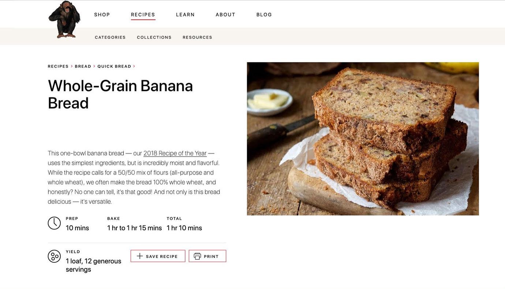

# Full-stack assignment
This assignment consists of two parts:

1. Website - a mainly front-end focused assignment, to assess your front-end capabilities.
2. NodeJS Backend - a mainly back-end focused task, where you can show off your back-end development skills.

You can fork this repository and show your result.

Good luck!


## 1. Website

We want you to re-create this page using the following tools:



Everything is done through git, so to share this project we would like you to send us a git repo on for example like Github/Gitlab etc.

We would like you to use [Next.js](https://nextjs.org/) as a start for this assignment, and in our apps we use [Material-UI](https://material-ui.com]) as a base for our components.

Create a few pages like this with different kind of text and link them together in the menu.

Images and icons you can use either random from the internet or other packages.


#### What are we expecting:
- Neatly written and formatted code for production level environment (scalability in mind)
- Demonstration of knowledge on Mui
- Demonstration of knowledge on React
- Impress us with the skills you have

## 2. NodeJS Back-end

Create a node module that can assess a list of webservers and then returns a server with the lowest priority. Also create a unit test that can check if the function is running properly.

 

#### Requirements:
- A node module that has a `findServer()` function which returns a Promise that either:
  - Resolves and return an online server with the lowest priority.
  - Reject with an error if no servers are online.

- The HTTP server requests should be used to check if the server is online or offline depending on the following requirements:
  - All server GET requests should be run in parallel.
  - The GET request should timeout after 5 seconds.
  - When the GET request responds with a statuscode of 200-299 it is considered online.

- A unit test that checks all the underlying components/requirements.
  - The server requests should be mocked.

#### JSON Array to use

```json
[
  {
    "url": "https://does-not-work.perfume.new",
    "priority": 1
  },
  {
    "url": "https://gitlab.com",
    "priority": 4
  },
  {
    "url": "http://app.scnt.me",
    "priority": 3
  },
  {
    "url": "https://offline.scentronix.com",
    "priority": 2
  }
]
``` 

#### What are we expecting:
- Neatly written and formatted code for production level environment
- Demonstration of knowledge on NodeJS
- Demonstration of knowledge on Promises
- Demonstration of knowledge on Unit Testing including experience with mocking target server(s).
- Impress us with the skills you have (Typescript preferred)

#### Tools and frameworks you probably want to use:
`NodeJS LTS`, `Jest`, `jest-fetch-mock`
