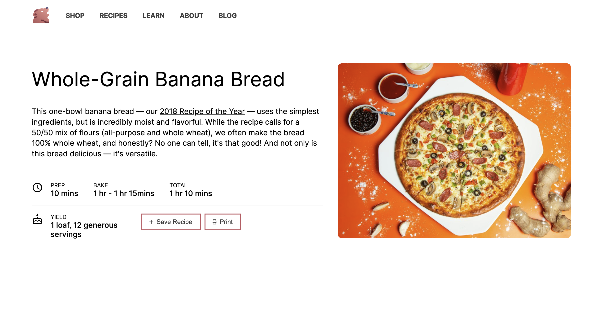
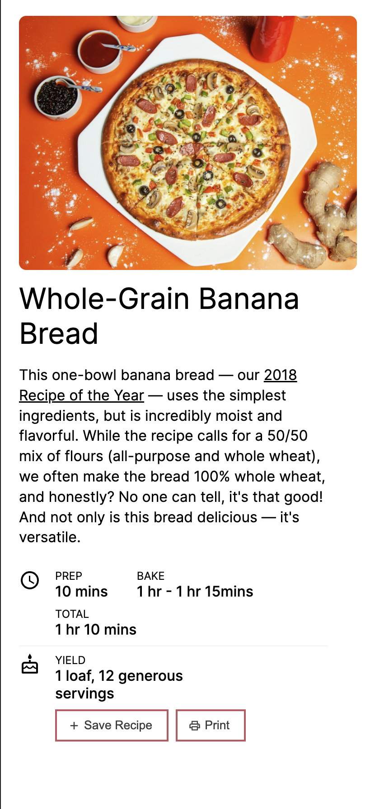

# Scentronix web interviews

Hello guys,

I applied for the fullstack position. This is my results of the assignment.

## 1. Website

Folder: `./web`

Regarding the web, I tried to make it as close as possible to the design. 
To be honest, I haven't spent time on NextJs as well as Mui UI, hence I don't have much experience on this. 

So to save time and focus on the main part of the assignment I decided not to use Mui UI when implementing the design. Instead, I use pure CSS, with the support of CSS-in-JS framework, styled-components. I add some small enhancements so the page can work well on mobile web. 

I do believe that, with the basic knowledge of CSS I can work well with any CSS approaches as well as UI library like Mui UI.

## 2. NodeJS Back-end

Folder: `./nodejs-interviews`

I don't have many things to say, the tests explain themself.